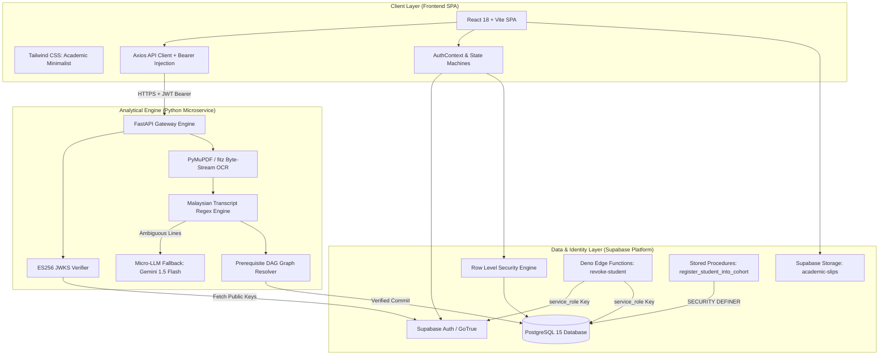
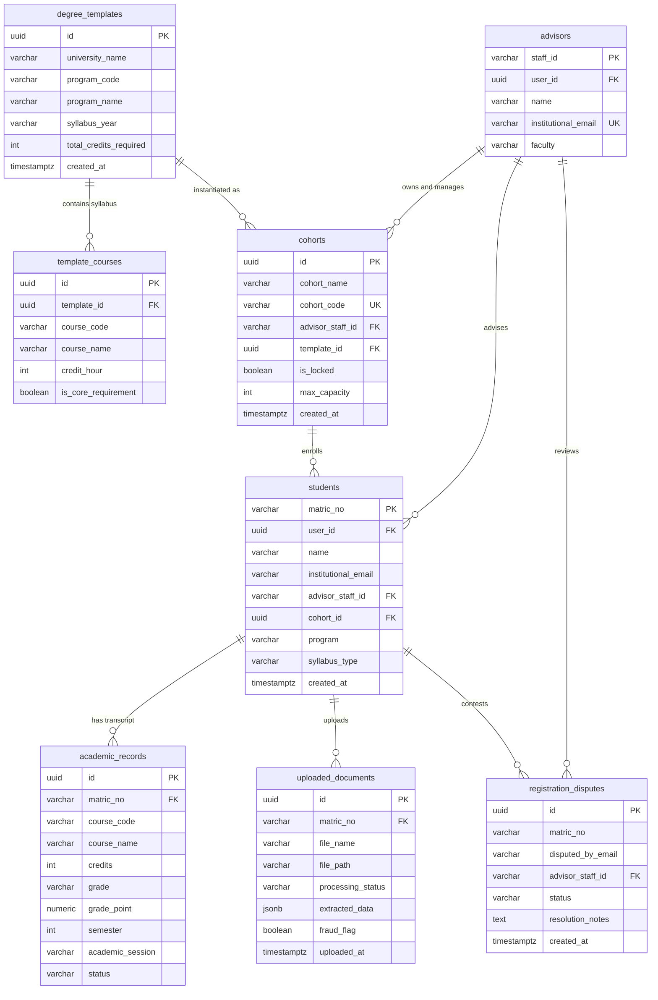
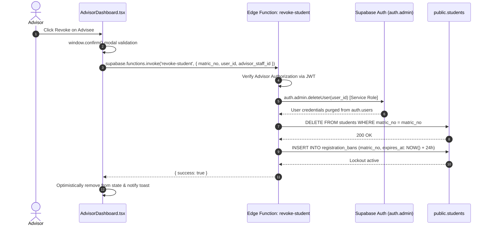

# LUMA • Technical Architecture & Database Schema Document
## Multi-Tenant Smart Academic Advising Architecture Specification

---

### Document Metadata
* **System:** LUMA Academic Advising Engine
* **Classification:** Architectural Design Document (ADD)
* **Author:** Principal Staff Engineer & Core Infrastructure Team
* **Status:** Active Production Specification
* **Version:** 1.0.0

---

## 1. Technology Stack & Topology

LUMA is engineered around a hybrid cloud architecture combining a high-performance, single-page application (SPA), a managed backend-as-a-service (BaaS) for persistence and authentication, and an asynchronous analytical Python microservice for computer vision, natural language processing, and Directed Acyclic Graph (DAG) graph resolution.



### Component Breakdown

| Layer | Technology | Primary Responsibilities | Key File References |
| :--- | :--- | :--- | :--- |
| **Client Frontend** | React 18, Vite, React Router v7, Tailwind CSS | High-density institutional advising dashboards, real-time regex form validation, student transcript staging, advisor surveillance tables. | [`src/app/App.tsx`](file:///d:/smart-aa-system/src/app/App.tsx), [`src/app/routes.tsx`](file:///d:/smart-aa-system/src/app/routes.tsx), [`StudentAuth.tsx`](file:///d:/smart-aa-system/src/pages/auth/StudentAuth.tsx), [`AdvisorDashboard.tsx`](file:///d:/smart-aa-system/src/app/pages/advisor/AdvisorDashboard.tsx) |
| **Authentication & Client Gateway** | Supabase Auth (GoTrue), Supabase JS Client | JWT session persistence, auto-refresh tokens, client cache invalidation, and bearer token attachment. | [`src/context/AuthContext.tsx`](file:///d:/smart-aa-system/src/context/AuthContext.tsx), [`src/lib/supabase.ts`](file:///d:/smart-aa-system/src/lib/supabase.ts), [`src/lib/api.ts`](file:///d:/smart-aa-system/src/lib/api.ts) |
| **Database & Identity Gateway** | Supabase PostgreSQL 15 | Relational data persistence, Row Level Security (RLS) tenancy enforcement, immutable degree blueprints, registration disputes. | [`supabase/migrations/`](file:///d:/smart-aa-system/supabase/migrations) |
| **Privileged Execution Layer** | Supabase Edge Functions (Deno runtime) | Privileged user deletion bypassing RLS with `service_role` secret to prevent orphaned auth records and enforce registration bans. | Edge Function: `revoke-student` |
| **Analytical & Audit Backend** | FastAPI, Python 3.12, Uvicorn, PyMuPDF, NetworkX | Fast byte-stream PDF extraction, Malaysian transcript pattern matching, prerequisite DAG resolution, ES256 JWKS verification. | [`backend/app/main.py`](file:///d:/smart-aa-system/backend/app/main.py), [`backend/app/core/auth.py`](file:///d:/smart-aa-system/backend/app/core/auth.py), [`backend/app/v1/endpoints/audit.py`](file:///d:/smart-aa-system/backend/app/v1/endpoints/audit.py) |
| **Micro-LLM Fallback** | Gemini 1.5 Flash (via Groq / OpenAI-compatible client) | High-accuracy zero-temperature line-item extraction for ambiguous transcript rows failing strict regex parsing. | [`backend/app/engine/llm_fallback.py`](file:///d:/smart-aa-system/backend/app/engine/llm_fallback.py) |

---

## 2. Multi-Tenant Blueprint Database Schema

The core architectural breakthrough in LUMA is the **Multi-Tenant Blueprint Architecture** introduced in Migration `08_multi_tenant_blueprint_architecture.sql`. This separates universal curriculum standards from individual advisor cohorts, preventing syllabus versioning errors.

### 2.1 Entity-Relationship (ER) Diagram



---

### 2.2 Core Table Specifications (DDL & Constraints)

#### 1. `degree_templates` (Immutable University Program Blueprints)
Defines the canonical requirements for a university degree program. Immutable once deployed; versions are preserved by year.

```sql
CREATE TABLE degree_templates (
    id UUID PRIMARY KEY DEFAULT gen_random_uuid(),
    university_name VARCHAR(255) NOT NULL DEFAULT 'Universiti Teknologi Malaysia',
    program_code VARCHAR(50) NOT NULL, -- e.g. 'SECJ'
    program_name VARCHAR(255) NOT NULL, -- e.g. 'Software Engineering'
    syllabus_year VARCHAR(50) NOT NULL, -- e.g. '2024/2025'
    total_credits_required INT NOT NULL DEFAULT 130,
    created_at TIMESTAMPTZ NOT NULL DEFAULT NOW(),
    updated_at TIMESTAMPTZ NOT NULL DEFAULT NOW(),
    CONSTRAINT uq_degree_templates_univ_prog_year UNIQUE (university_name, program_code, syllabus_year)
);

CREATE INDEX idx_degree_templates_lookup 
ON degree_templates(university_name, program_code, syllabus_year);
```

#### 2. `template_courses` (Curriculum Syllabus per Blueprint)
The course structure tied to a specific `degree_templates` blueprint. Deleted automatically if a template is purged.

```sql
CREATE TABLE template_courses (
    id UUID PRIMARY KEY DEFAULT gen_random_uuid(),
    template_id UUID NOT NULL REFERENCES degree_templates(id) ON DELETE CASCADE,
    course_code VARCHAR(50) NOT NULL, -- e.g. 'SECJ1013'
    course_name VARCHAR(255) NOT NULL, -- e.g. 'Programming Technique I'
    credit_hour INT NOT NULL DEFAULT 3,
    is_core_requirement BOOLEAN NOT NULL DEFAULT true,
    created_at TIMESTAMPTZ NOT NULL DEFAULT NOW(),
    CONSTRAINT uq_template_courses_template_course UNIQUE (template_id, course_code)
);

CREATE INDEX idx_template_courses_template_id ON template_courses(template_id);
CREATE INDEX idx_template_courses_course_code ON template_courses(course_code);
```

#### 3. `cohorts` (The Tinkercad Gateway Table)
Connects an Academic Advisor to an immutable `degree_templates` row via a 6-character registration code.

```sql
CREATE TABLE cohorts (
    id UUID PRIMARY KEY DEFAULT gen_random_uuid(),
    cohort_name VARCHAR(255) NOT NULL,
    cohort_code VARCHAR(8) NOT NULL UNIQUE, -- e.g. 'ABC-123'
    advisor_staff_id VARCHAR(50) NOT NULL REFERENCES advisors(staff_id) ON DELETE CASCADE,
    template_id UUID NOT NULL REFERENCES degree_templates(id) ON DELETE RESTRICT,
    is_locked BOOLEAN NOT NULL DEFAULT false,
    max_capacity INT NOT NULL DEFAULT 50,
    created_at TIMESTAMPTZ NOT NULL DEFAULT NOW(),
    updated_at TIMESTAMPTZ NOT NULL DEFAULT NOW()
);

CREATE INDEX idx_cohorts_advisor ON cohorts(advisor_staff_id);
CREATE INDEX idx_cohorts_code ON cohorts(cohort_code);
CREATE INDEX idx_cohorts_template ON cohorts(template_id);
```

#### 4. `students` (Advisee Records)
Enforces a strict UTM matric regex constraint. Primary key is the institutional matric number.

```sql
CREATE TABLE students (
    matric_no VARCHAR(20) PRIMARY KEY CHECK (matric_no ~* '^[A-Z]\d{2}[A-Z]{2}\d{4}$'),
    user_id UUID REFERENCES auth.users(id) ON DELETE SET NULL,
    name VARCHAR(255) NOT NULL,
    institutional_email VARCHAR(255),
    advisor_staff_id VARCHAR(50) REFERENCES advisors(staff_id) ON DELETE SET NULL,
    cohort_id UUID REFERENCES cohorts(id) ON DELETE SET NULL,
    program VARCHAR(50) NOT NULL,
    syllabus_type VARCHAR(50) NOT NULL,
    created_at TIMESTAMPTZ NOT NULL DEFAULT NOW(),
    updated_at TIMESTAMPTZ NOT NULL DEFAULT NOW()
);

CREATE INDEX idx_students_cohort ON students(cohort_id);
CREATE INDEX idx_students_advisor ON students(advisor_staff_id);
CREATE INDEX idx_students_user_id ON students(user_id);
```

#### 5. `registration_disputes` (Loose Admission Safety Net)
Enables unauthenticated students to dispute an already-registered matric number.

```sql
CREATE TABLE registration_disputes (
    id UUID PRIMARY KEY DEFAULT gen_random_uuid(),
    matric_no VARCHAR(20) NOT NULL,
    disputed_by_email VARCHAR(255) NOT NULL,
    advisor_staff_id VARCHAR(50),
    status VARCHAR(20) NOT NULL DEFAULT 'open' CHECK (status IN ('open', 'resolved', 'rejected')),
    resolution_notes TEXT,
    created_at TIMESTAMPTZ NOT NULL DEFAULT NOW(),
    updated_at TIMESTAMPTZ NOT NULL DEFAULT NOW()
);

CREATE INDEX idx_registration_disputes_matric ON registration_disputes(matric_no);
CREATE INDEX idx_registration_disputes_advisor ON registration_disputes(advisor_staff_id);
```

---

## 3. Security Architecture & Boundary Verification

### 3.1 Supabase Row Level Security (RLS) Boundaries

All institutional tables enforce PostgreSQL Row Level Security (`ENABLE ROW LEVEL SECURITY` and `FORCE ROW LEVEL SECURITY`).

```mermaid
graph TD
    UserRequest[Incoming Client Request] --> AuthCheck{auth.jwt() Present?}
    AuthCheck -->|No (Anon Role)| AnonCheck{Target Table & Action}
    AnonCheck -->|SELECT cohorts WHERE is_locked=false| AllowAnonSelect[Allow Unlocked Cohort Lookup]
    AnonCheck -->|INSERT registration_disputes| AllowAnonInsert[Allow Dispute Filing]
    AnonCheck -->|All Other Tables| DenyAnon[Deny Access - 401/403]

    AuthCheck -->|Yes (Authenticated)| RoleCheck{Is Student or Advisor?}
    RoleCheck -->|Student: user_id = auth.uid()| StudentRLS[Read Own Student & Academic Records Only]
    RoleCheck -->|Advisor: institutional_email matches JWT| AdvisorRLS[Manage Own Cohorts, Advisees & Disputes]
```

#### RLS Policy Definitions

| Table | Policy Name | Permitted Role | Operation | Predicate (USING / WITH CHECK) |
| :--- | :--- | :--- | :--- | :--- |
| `degree_templates` | Public Read Blueprints | `anon`, `authenticated` | `SELECT` | `true` |
| `template_courses` | Public Read Courses | `anon`, `authenticated` | `SELECT` | `true` |
| `cohorts` | Public Unlocked Cohorts | `anon`, `authenticated` | `SELECT` | `is_locked = false` |
| `cohorts` | Advisor Manage Cohorts | `authenticated` | `ALL` | `advisor_staff_id IN (SELECT staff_id FROM advisors WHERE institutional_email = (auth.jwt()->>'email') OR user_id = auth.uid())` |
| `students` | Student Read Self | `authenticated` | `SELECT` | `user_id = auth.uid() OR institutional_email = (auth.jwt()->>'email')` |
| `students` | Advisor Read Cohort | `authenticated` | `SELECT` | `advisor_staff_id IN (SELECT staff_id FROM advisors WHERE institutional_email = (auth.jwt()->>'email'))` |
| `registration_disputes` | Anon Dispute Filing | `anon`, `authenticated` | `INSERT` | `true` |
| `registration_disputes` | Advisor Dispute Review | `authenticated` | `SELECT`, `UPDATE` | `advisor_staff_id IN (SELECT staff_id FROM advisors WHERE institutional_email = (auth.jwt()->>'email'))` |

---

### 3.2 Asymmetric ES256 JWT Verification (`backend/app/core/auth.py`)

The FastAPI backend does **not** share an insecure static secret with the frontend. Instead, it cryptographically validates user session tokens against Supabase's live JSON Web Key Set (JWKS) using the Elliptic Curve `ES256` asymmetric algorithm.

#### In-Process JWKS Cache Engine
```python
# In-process JWKS cache — one fetch per cold start, refreshed every 3600 seconds
_jwks_cache: list = []
_jwks_fetched_at: float = 0.0
_jwks_lock = threading.Lock()
_JWKS_TTL_SECONDS = 3600

def _get_jwks() -> list:
    global _jwks_cache, _jwks_fetched_at
    with _jwks_lock:
        if _jwks_cache and (time.monotonic() - _jwks_fetched_at) < _JWKS_TTL_SECONDS:
            return _jwks_cache
        try:
            resp = httpx.get(JWKS_URL, timeout=5.0)
            resp.raise_for_status()
            _jwks_cache = resp.json().get("keys", [])
            _jwks_fetched_at = time.monotonic()
            return _jwks_cache
        except Exception as e:
            if _jwks_cache:
                # Outage resilience: serve stale cache during transient JWKS failures
                return _jwks_cache
            raise HTTPException(status_code=503, detail="JWKS keys unavailable")
```

#### Advisor Cross-Referencing Check (`_check_advisor_identity`)
Even if an incoming JWT is cryptographically valid, a rogue advisor could theoretically submit mutations on behalf of another lecturer. LUMA enforces strict identity cross-referencing on every mutating endpoint:

```python
def _check_advisor_identity(jwt_payload: dict, claimed_advisor_id: str) -> None:
    jwt_email = (jwt_payload.get("email") or "").strip().lower()
    res = supabase_svc.client.table("advisors") \
        .select("staff_id") \
        .eq("institutional_email", jwt_email) \
        .maybe_single() \
        .execute()

    if not res.data:
        raise HTTPException(status_code=403, detail="JWT identity is not an advisor.")
    
    actual_staff_id = res.data.get("staff_id")
    if actual_staff_id != claimed_advisor_id:
        # Cross-reference failure: token identity does not match payload claimed ID
        raise HTTPException(status_code=403, detail="Advisor identity mismatch.")
```

---

### 3.3 Atomic Registration RPC (`register_student_into_cohort`)

To prevent registration race conditions where multiple students oversubscribe a cohort or claim duplicate matric numbers concurrently, student enrollment is handled via an atomic PostgreSQL function executing with `SECURITY DEFINER`:

```sql
CREATE OR REPLACE FUNCTION register_student_into_cohort(
    p_matric_no TEXT,
    p_full_name TEXT,
    p_email TEXT,
    p_cohort_code TEXT,
    p_user_id UUID
)
RETURNS JSONB
LANGUAGE plpgsql
SECURITY DEFINER
AS $$
DECLARE
    v_cohort RECORD;
    v_template RECORD;
    v_current_count INT;
BEGIN
    -- 1. Format validation
    IF p_matric_no !~* '^[A-Z]\d{2}[A-Z]{2}\d{4}$' THEN
        RAISE EXCEPTION 'Invalid matric format. Expected format: A24CS0001'
            USING ERRCODE = '22000';
    END IF;

    -- 2. Lock cohort row for update to prevent concurrent capacity race condition
    SELECT * INTO v_cohort
    FROM cohorts
    WHERE cohort_code = UPPER(TRIM(p_cohort_code))
    FOR UPDATE;

    IF NOT FOUND OR v_cohort.is_locked = true THEN
        RAISE EXCEPTION 'Invalid or locked Cohort Code.'
            USING ERRCODE = '22023';
    END IF;

    -- 3. Check capacity
    SELECT COUNT(*) INTO v_current_count
    FROM students
    WHERE cohort_id = v_cohort.id;

    IF v_current_count >= v_cohort.max_capacity THEN
        RAISE EXCEPTION 'Cohort has reached maximum capacity.'
            USING ERRCODE = '23514';
    END IF;

    -- 4. Extract degree template metadata
    SELECT * INTO v_template
    FROM degree_templates
    WHERE id = v_cohort.template_id;

    -- 5. Insert student record atomically
    INSERT INTO students (
        matric_no, user_id, name, institutional_email,
        advisor_staff_id, cohort_id, program, syllabus_type
    ) VALUES (
        UPPER(TRIM(p_matric_no)), p_user_id, TRIM(p_full_name), LOWER(TRIM(p_email)),
        v_cohort.advisor_staff_id, v_cohort.id, v_template.program_code, v_template.syllabus_year
    );

    RETURN jsonb_build_object(
        'success', true,
        'matric_no', p_matric_no,
        'cohort_name', v_cohort.cohort_name,
        'program', v_template.program_code
    );
END;
$$;
```

---

### 3.4 Privileged Revocation Edge Function (`revoke-student`)

Because client tokens and standard advisor logins are bounded by RLS, deleting a user from `auth.users` requires a privileged execution environment. LUMA implements this via the `revoke-student` Supabase Edge Function:



---

## 4. API Surface & Contract Specifications

### 4.1 FastAPI Degree Audit Service

All endpoints require `Authorization: Bearer <SUPABASE_JWT>` verified against JWKS.

```
POST /api/v1/audit/process-storage
Headers:
  Authorization: Bearer <JWT>
Body:
  {
    "storage_path": "academic-slips/A24CS0001/slip_sem1.pdf",
    "advisor_id": "STAFF-LIYANA",
    "university_id": "UTM",
    "matric_number": "A24CS0001"
  }
Response (200 OK):
  DegreeAuditResponse
```

```
POST /api/v1/audit/extract
Headers:
  Authorization: Bearer <JWT>
Body:
  {
    "storage_path": "academic-slips/A24CS0001/slip_sem1.pdf",
    "advisor_id": "STAFF-LIYANA"
  }
Response (200 OK):
  ExtractPDFResponse: {
    "student_name": "ALEX TAN",
    "matric_number": "A24CS0001",
    "academic_session": "2024/2025",
    "semester": 1,
    "courses": [
      {
        "course_code": "SECJ1013",
        "course_name": "Programming Technique I",
        "credits": 3,
        "grade": "A",
        "grade_point": 4.0,
        "status": "Passed"
      }
    ]
  }
```

```
POST /api/v1/audit/finalize-approval
Headers:
  Authorization: Bearer <JWT>
Body:
  {
    "document_id": "8f3b2a1c-...",
    "matric_number": "A24CS0001",
    "student_name": "Alex Tan",
    "advisor_id": "STAFF-LIYANA",
    "academic_session": "2024/2025",
    "semester": 1,
    "courses": [...]
  }
Response (200 OK):
  FinalizeApprovalResponse: {
    "status": "success",
    "committed_count": 5,
    "matric_number": "A24CS0001"
  }
```

---

## 5. Deployment Topology & Operational Boundaries

```
[Vercel / Cloudflare Pages] ── HTTPS ──> [React 18 SPA Frontend]
                                                │
                                  ┌─────────────┴─────────────┐
                                  ▼                           ▼
                        [Supabase Cloud Platform]     [Render Web Service]
                        - GoTrue Auth (JWKS)          - FastAPI / Python 3.12
                        - PostgreSQL 15 Database      - PyMuPDF / NetworkX
                        - Edge Functions (Deno)       - Gemini 1.5 Flash Micro-LLM
                        - S3-Compatible Storage
```
