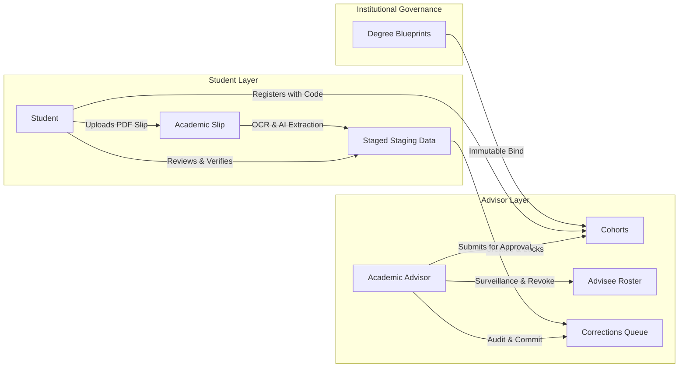
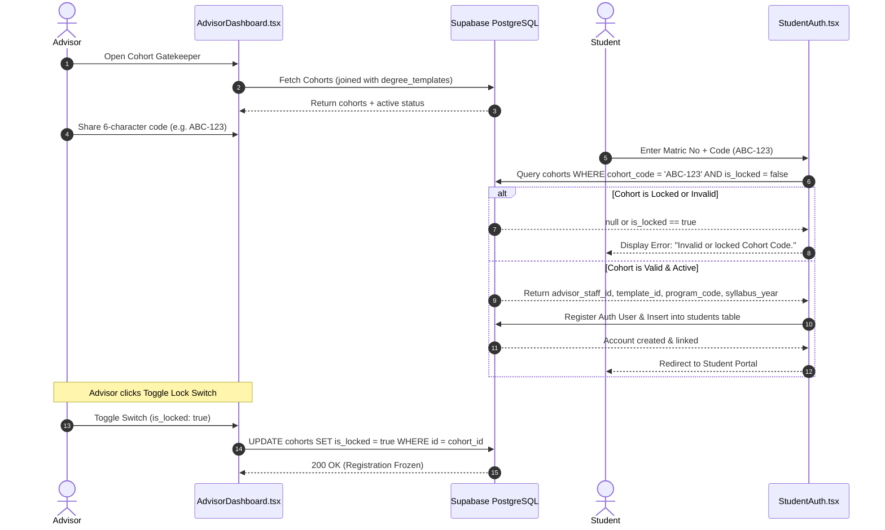
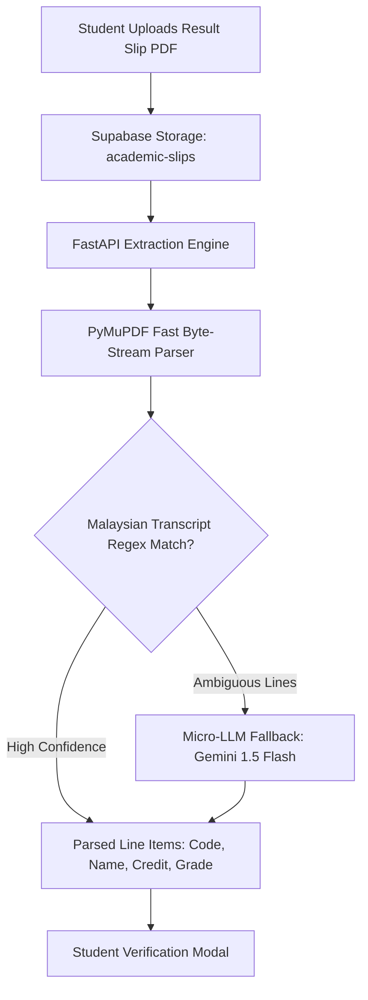
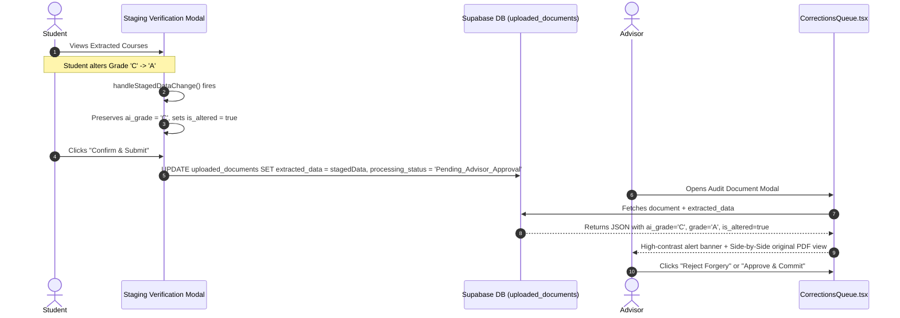
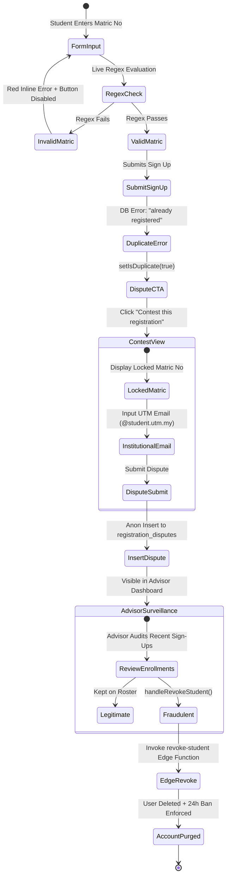
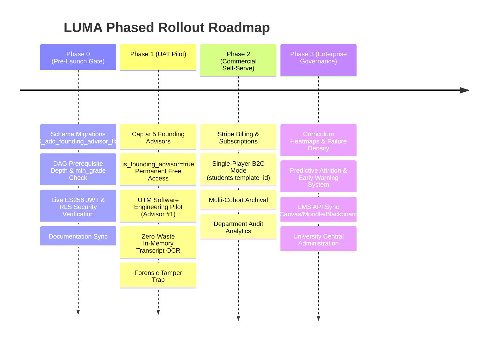

# LUMA • Product Requirements Document (PRD)
## Multi-Tenant Smart Academic Advising Software as a Service (SaaS)

---

### Document Information
* **Product Name:** LUMA (Smart Academic Advising System)
* **Author:** Principal Staff Engineer & Technical Architecture Team
* **Target Institution:** Universiti Teknologi Malaysia (UTM) & Partner Universities
* **Status:** Production Architecture Specification
* **Version:** 1.0.0

---

## 1. Executive Summary & Product Vision

### 1.1 Executive Summary
**LUMA** is an enterprise-grade, multi-tenant Smart Academic Advising SaaS designed to eliminate the manual, paper-driven friction in university degree audits, prerequisite tracking, and cohort management. By bridging student-submitted academic slips with computer vision OCR, micro-LLM extraction, and deterministic Directed Acyclic Graph (DAG) prerequisite verification, LUMA automates degree progression audits while introducing zero-trust tamper detection and advisor surveillance.

### 1.2 Core Product Vision
Traditional academic advising relies on students manually interpreting fragmented syllabus handbooks and advisors physically reviewing printed grade slips. This leads to human error, syllabus drift, delayed graduation eligibility checks, and academic record forgery.

LUMA replaces this obsolete model with:
1. **The Tinkercad Model:** Self-service student registration governed by 6-character, advisor-managed "Cohort Codes" that dynamically bind advisees to immutable degree blueprints without manual configuration.
2. **AI-Assisted Transcript Intelligence:** Automated extraction of course codes, credit hours, and grades via fast in-memory PDF stream parsing and zero-temperature LLM fallbacks.
3. **Forensic Tamper Trap:** Transparent staging interfaces that quietly capture student UI manipulations, preserving provenance flags (`is_altered`, `ai_grade`) to expose fraudulent grade edits to advisors.
4. **Loose Admission Safety Net:** Atomic capacity-locked cohort onboarding with real-time matric format validation, collision contestation workflows, and one-click account revocation.

---

## 2. Problem Statement & Opportunity

### 2.1 The Current Landscape
Academic advising across tertiary institutions faces critical structural challenges:

| Pain Point | Root Cause | Impact on University Operations |
| :--- | :--- | :--- |
| **Manual Data Entry Bottlenecks** | Advisors manually transcribe grades from PDF/scanned slips into internal management spreadsheets. | Wasted administrative hours, slow audit turnaround, high advisor burnout. |
| **Syllabus & Curriculum Drift** | Students self-select programs and syllabus versions (e.g., enrolling in 2021/2022 rules rather than 2024/2025). | Students take incorrect courses, miss new graduation requirements, and face delayed convocations. |
| **Academic Forgery & Grade Tampering** | Students submit altered PDFs or tamper with client form fields to falsely report passing grades. | Academic integrity violations slip past unverified advisor queues without forensic provenance. |
| **Advising Onboarding Friction** | Manual student roster initialization requires batch CSV processing by central IT. | New semester cohorts experience weeks of delay before advisor allocations are established. |
| **Race Conditions in Registration** | Lack of atomic locks allows cohort over-subscription and matric collisions. | Duplicate student accounts, corrupted student records, and orphaned database states. |

### 2.2 The LUMA Solution
LUMA solves these systemic vulnerabilities through a decoupled, zero-trust cloud architecture. By separating **Degree Structures** (`degree_templates`) from **Cohort Deployments** (`cohorts`), universities maintain absolute curricular integrity while providing advisors granular control over student cohorts.

---

## 3. User Personas & Role Matrix

LUMA enforces strict role-based isolation between two primary institutional actors: **Students** and **Academic Advisors**.



### 3.1 Student Persona
* **Profile:** Undergraduate advisee enrolled in a degree program (e.g., Bachelor of Computer Science - Software Engineering, UTM).
* **Objectives:**
  * Effortlessly register into their advisor's official cohort without figuring out complex syllabus versions.
  * Upload semester examination slips and verify extracted grades in real time.
  * Monitor cumulative grade point average (CGPA) progression and graduation audit checklists.
* **Core Responsibilities & Workflow:**
  1. Register via [`StudentAuth.tsx`](file:///d:/smart-aa-system/src/pages/auth/StudentAuth.tsx) using a valid UTM Matric Number (`A24CS0001`) and assigned 6-character Cohort Code (`ABC-123`).
  2. Upload examination result slips (PDF format) in [`StudentPortal.tsx`](file:///d:/smart-aa-system/src/app/pages/student/StudentPortal.tsx).
  3. Verify staged course entries. Any corrections made to grades or course codes are submitted for advisor audit.
  4. Review prerequisite clearance graphs and syllabus completion in [`DegreeAuditView.tsx`](file:///d:/smart-aa-system/src/app/pages/student/DegreeAuditView.tsx) and [`AcademicHistoryView.tsx`](file:///d:/smart-aa-system/src/app/pages/student/AcademicHistoryView.tsx).

### 3.2 Academic Advisor Persona
* **Profile:** Faculty lecturer responsible for academic guidance, student progression tracking, and official transcript verification.
* **Founding Advisor Entitlement:** During Phase 1 UAT Pilot, up to 5 Founding Advisors are onboarded. Flagging an advisor with `is_founding_advisor = true` in `public.advisors` grants permanently free, full access across all platform capabilities without monthly audit quotas or subscription tier limits.
* **Objectives:**
  * Maintain active advising cohorts with instant registration code generation and manual lock toggles.
  * Rapidly audit student-submitted transcripts against original source PDFs.
  * Identify at-risk students (CGPA < 2.50 or academic probation) before exam deadlines.
  * Detect and neutralize student tampering or fraudulent registrations.
* **Core Responsibilities & Workflow:**
  1. Manage cohorts in [`AdvisorDashboard.tsx`](file:///d:/smart-aa-system/src/app/pages/advisor/AdvisorDashboard.tsx), toggling `is_locked` when cohort rosters reach capacity.
  2. Audit submitted student slips in [`CorrectionsQueue.tsx`](file:///d:/smart-aa-system/src/app/pages/advisor/CorrectionsQueue.tsx), inspecting original document PDFs alongside extracted records.
  3. Detect digital forgery via highlighted system warnings (`fraud_flag`, `is_altered`, `ai_grade`).
  4. Monitor recent enrollments in the Surveillance Panel and invoke [`revoke-student`](file:///d:/smart-aa-system/src/app/pages/advisor/AdvisorDashboard.tsx#L167-L190) on illegitimate sign-ups.

---

## 4. Detailed Functional Specifications & Workflows

### 4.1 The "Tinkercad Model" (Cohort Gatekeeper)



#### Detailed Workflow
1. **Advisor Cohort Initialization:**
   * Advisors generate persistent, human-readable 6-character alphanumeric cohort codes formatted as `XXX-XXX` (e.g., `ABC-123`) using the database function `generate_cohort_code()`.
   * Each cohort row references an immutable `template_id` from `degree_templates`, locking in university, program code, syllabus year, and credit requirements.
2. **Lockable Access Control:**
   * Each cohort features an interactive `is_locked` boolean toggle in [`AdvisorDashboard.tsx`](file:///d:/smart-aa-system/src/app/pages/advisor/AdvisorDashboard.tsx#L138-L164).
   * When unlocked (`is_locked = false`), public and anonymous users can validate the code to join.
   * When locked (`is_locked = true`), the code immediately rejects sign-up attempts with `Invalid or locked Cohort Code.`
3. **Zero-Configuration Student Registration:**
   * Students do not select their faculty, degree program, or curriculum catalog.
   * Supplying the cohort code dynamically assigns `program`, `syllabus_type`, `advisor_staff_id`, and `cohort_id` directly in the database insert, preventing syllabus drift.

---

### 4.2 AI-Assisted Zero-Waste Transcript Parsing



#### Extraction Engine Characteristics
* **In-Memory Byte-Stream Processing:** Uploaded slips are read directly in memory using `fitz` (PyMuPDF) in `<50ms` without writing temporary files to server disks ([`PDFExtractor`](file:///d:/smart-aa-system/backend/app/engine/extractor.py#L10-L26)).
* **Deterministic Regex Parsing:** [`MalaysianTranscriptParser`](file:///d:/smart-aa-system/backend/app/engine/parsers/malaysian_regex.py) scans extracted text against Malaysian university transcript patterns, validating course code structures (`SECJ1013`), grade strings (`A+`, `A`, `B-`, `HL`), and credit values.
* **Zero-Temperature LLM Fallback:** Ambiguous lines that fail regex heuristics are dispatched to [`MicroLLMFallback`](file:///d:/smart-aa-system/backend/app/engine/llm_fallback.py#L29-L75) (Gemini 1.5 Flash / Groq LLM) with a strict zero-temperature JSON extraction schema, preventing hallucinated courses.

---

### 4.3 The "Tamper Trap" (Forensic Provenance Verification)

To combat student fraud without degrading legitimate usability, LUMA implements a silent forensic provenance tracking mechanism:



#### Provenance Data Structure
When a student interacts with the staging modal in [`StudentPortal.tsx`](file:///d:/smart-aa-system/src/app/pages/student/StudentPortal.tsx#L286-L301), field updates execute the following provenance lock:

```typescript
// Grade and Course Code Provenance Tracking (Anti-Tampering)
if (!newData.courses[index].ai_grade && field === "grade") {
  newData.courses[index].ai_grade = newData.courses[index].grade; // Preserves AI ground-truth
}
if (!newData.courses[index].ai_course_code && field === "course_code") {
  newData.courses[index].ai_course_code = newData.courses[index].course_code; // Preserves AI ground-truth
}

newData.courses[index].is_altered = true;
newData.courses[index][field] = value.toUpperCase();
```

#### Advisor Audit Interface
* When `is_altered: true` or `fraud_flag: true`, [`CorrectionsQueue.tsx`](file:///d:/smart-aa-system/src/app/pages/advisor/CorrectionsQueue.tsx#L137-L142) renders an institutional warning:
  > **⚠️ System Alert: Metadata Anomaly Detected. Suspected Digital Forgery. ⚠️**
* The advisor is presented with a synchronized side-by-side view: the original rendered PDF on the left, and the student's claimed data on the right.
* Advisors can commit verified records to `academic_records` via FastAPI's DAG verification endpoint [`finalize-approval`](file:///d:/smart-aa-system/backend/app/v1/endpoints/audit.py#L327-L440) or immediately reject the submission.

---

### 4.4 Loose Admission Safety Net & Collision Dispute Flow



#### 1. Live Matric Validation
* The Matric Number input enforces real-time validation via regex `/^[A-Z]\d{2}[A-Z]{2}\d{4}$/i` (e.g., `A24CS0001`) in both [`StudentAuth.tsx`](file:///d:/smart-aa-system/src/pages/auth/StudentAuth.tsx#L24-L26) and [`LandingPage.tsx`](file:///d:/smart-aa-system/src/app/pages/LandingPage.tsx#L43-L45).
* Non-empty invalid inputs immediately render red helper text: `"Expected format: A24CS0001"`.
* The main registration submit button is strictly disabled until the matric format is valid.

#### 2. Duplicate Collision Catch & Contest View Swap
* If `signUpStudent` returns an error containing `"already registered"`, the form exposes `isDuplicate: true`.
* Below the error banner, a minimal CTA appears: `"Is this your matric number? Contest this registration."`
* Clicking the CTA triggers an in-place view swap to the **Contest Registration** form:
  * The collided `matricNo` is displayed in a locked, read-only field.
  * The student enters their official UTM institutional email (`@student.utm.my` or `@utm.my`).
  * On submit, the system extracts the `advisor_staff_id` from the entered cohort code and executes an anonymous insert into `registration_disputes`:
    ```typescript
    const { error } = await supabase.from('registration_disputes').insert({
      matric_no: matricNo.toUpperCase(),
      disputed_by_email: institutionalEmail,
      advisor_staff_id: advisorStaffId
    });
    ```

#### 3. Advisor Surveillance & Account Revocation
* [`AdvisorDashboard.tsx`](file:///d:/smart-aa-system/src/app/pages/advisor/AdvisorDashboard.tsx#L630-L720) displays a **Recent Enrollments Surveillance Panel** listing all advisees sorted descending by `created_at`.
* Advisors can review newly self-registered accounts. If an account is identified as fraudulent, the advisor clicks **Revoke**.
* A confirmation prompt warns:
  > *"Are you sure you want to revoke this student's access? This will permanently delete their account and enforce a 24-hour registration ban on this matric number."*
* On confirmation, [`handleRevokeStudent`](file:///d:/smart-aa-system/src/app/pages/advisor/AdvisorDashboard.tsx#L167-L190) invokes the Supabase Edge Function `revoke-student`, which utilizes the `service_role` key to permanently delete the student from `auth.users` and `public.students`.

---

## 5. Non-Functional Requirements (NFRs)

| Category | Requirement | Specification |
| :--- | :--- | :--- |
| **Performance** | Transcript Extraction Latency | `< 350ms` for PyMuPDF regex pass; `< 2.5s` for Micro-LLM fallback. |
| **Security** | Asymmetric Token Authentication | FastAPI endpoints must verify Supabase JWTs against live JWKS via ES256. |
| **Data Isolation** | Multi-Tenant Scoping | Advisors must never access advisees or documents outside their own assigned cohorts. |
| **Reliability** | JWKS Stale Cache Resilience | Transient JWKS network outages must serve cached public keys (TTL: 1 hour) without dropping live requests. |
| **Auditing** | Audit Trail Integrity | Provenance fields (`is_altered`, `ai_grade`) cannot be wiped or bypassed by client-side requests. |
| **Accessibility & Design** | Institutional UI Standards | Strict Academic Minimalist interface adhering to high-contrast WCAG AA standards. |

---

## 6. Product Roadmap & Phased Rollout Strategy

LUMA is developed and released in four distinct phases to ensure uncompromising data integrity, security validation, and controlled institutional adoption.



### Phase 0: Pre-Launch Gate & Infrastructure Hardening (Current)
* **Objective:** Establish unbreakable baseline security, schema version control, and prerequisite data integrity prior to exposing the platform to external users.
* **Key Deliverables:**
  1. **Idempotent Schema Versioning:** Database migration `10_add_founding_advisor_flag.sql` adding `is_founding_advisor BOOLEAN DEFAULT false` to `advisors`.
  2. **Curriculum Integrity Gate:** Verification script [`verify_phase0_curriculum.py`](file:///d:/smart-aa-system/scripts/verify_phase0_curriculum.py) enforcing graph depth and eliminating false-GREEN risks by asserting explicit `min_grade >= 'C'`.
  3. **Security Gate Proof:** Live execution of asymmetric ES256 JWT verification (`401/403` rejection logs) and 2x2 multi-tenant RLS isolation proving zero cross-tenant data leakage.
  4. **Documentation Sync:** Technical formalization of "Two Doors, One House" B2B2C ingress, hard client-side session invalidation, and strict JWT signature verification.

### Phase 1: UAT Pilot (Advisor #1 Launch)
* **Objective:** Execute real-world User Acceptance Testing (UAT) with our target launch cohort (Advisor #1: UTM Faculty of Computing, Software Engineering).
* **Cap & Eligibility:** Strictly capped at **maximum 5 Founding Advisors**.
* **Founding Advisor Privileges:** Every pilot advisor is designated with `is_founding_advisor = true` in `public.advisors`. This flag grants **permanently free, full access** across all current and future platform features without monthly audit quotas or subscription tier limits.
* **Target Feature Scope:**
  * Cohort Gatekeeper with 6-character alphanumeric lockable codes.
  * In-memory PyMuPDF transcript extraction with zero-temperature LLM fallback.
  * Forensic Tamper Trap (`is_altered`, `ai_grade`) and Advisor Corrections Queue.
  * Loose Admission Safety Net with matric format enforcement, collision contestation, and one-click privileged revocation.

### Phase 2: Commercial Self-Serve & Advisor Pro
* **Objective:** Transition from controlled pilot to self-sustaining Product-Led Growth (PLG) and individual advisor subscriptions.
* **Target Features:**
  * **Stripe Billing Integration:** Tiered self-service subscriptions (Freemium vs Advisor Pro vs Department Tier).
  * **Single-Player Mode (Door 2):** Direct student registration bound to degree blueprints via `students.template_id`, bypassing cohort dependencies.
  * **Advanced Cohort Management:** Multi-cohort scheduling, intake archival, and bulk document purge upon advisor sign-off.
  * **Email Notification Queues:** Background email dispatch for dispute resolutions and cohort invitations.

### Phase 3: Enterprise & Institutional Governance
* **Objective:** University-wide campus deployment and central academic administration.
* **Features Deferred to Phase 3:**
  * **Curriculum Heatmaps:** Aggregated multi-cohort bottleneck visualization, prerequisite failure density maps, and syllabus drop-off heatmaps identifying systemic academic hurdles across departments.
  * **Predictive Attrition & Early Warning System (EWS):** Probabilistic machine learning models evaluating student CGPA velocity, prerequisite retakes, and credit completion pace to forecast at-risk students before semester final exams.
  * **LMS API Synchronization:** Deep bidirectional integration (LTI 1.3 / REST) with university Learning Management Systems (Canvas, Blackboard, Moodle) to automatically ingest exam slips and synchronize verified audit reports.
  * **Dean & Registrar Portals:** Centralized university governance, multi-department faculty audits, and institutional accreditation compliance reporting.

